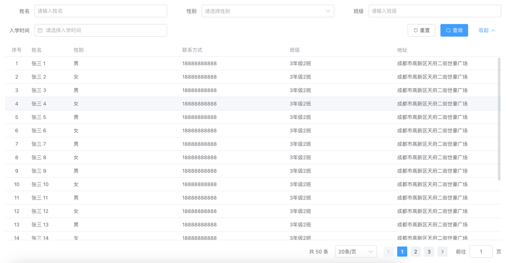

# vue-demo

bep-ui是一个基于vue3 + element plus 二次开发，以schema驱动快速生成管理台表单、表格页面的UI库

[组件使用示例](https://fernabby.github.io/vue-demo/#/examples/form/base)

## 安装

```shell
pnpm add bep-ui
```

## 使用

## 界面

### 表单

#### 基础表单


#### 搜索表单


### 表格

#### 基础表格



#### 数据展示表单


